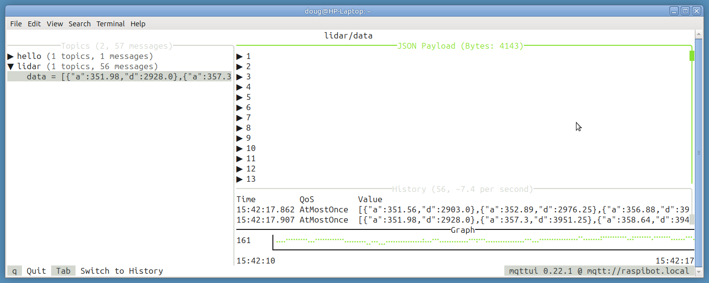
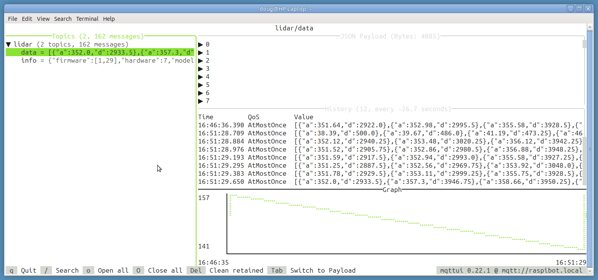
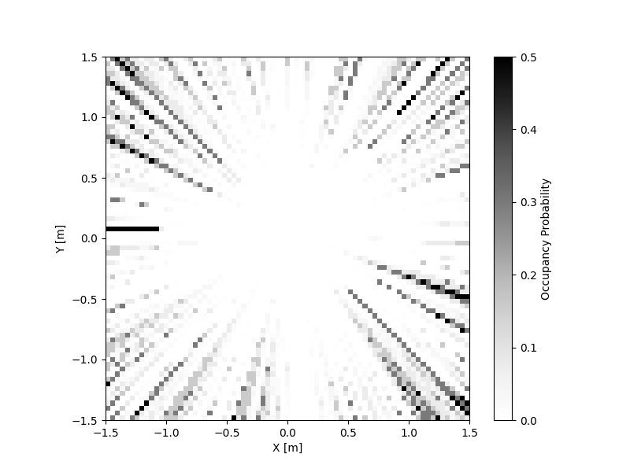
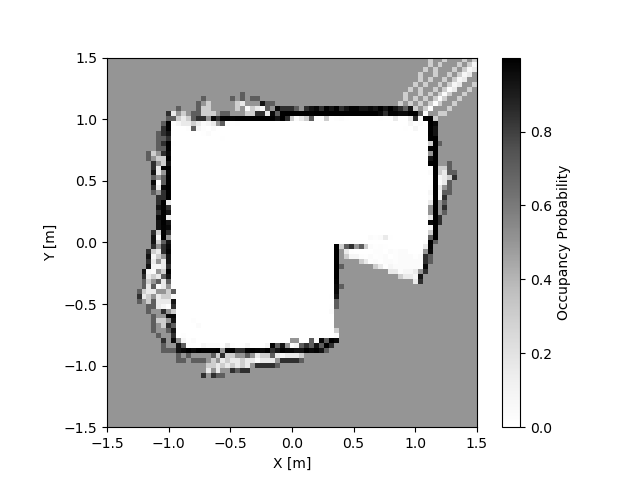
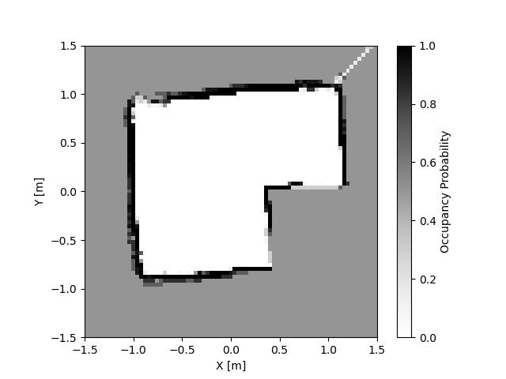
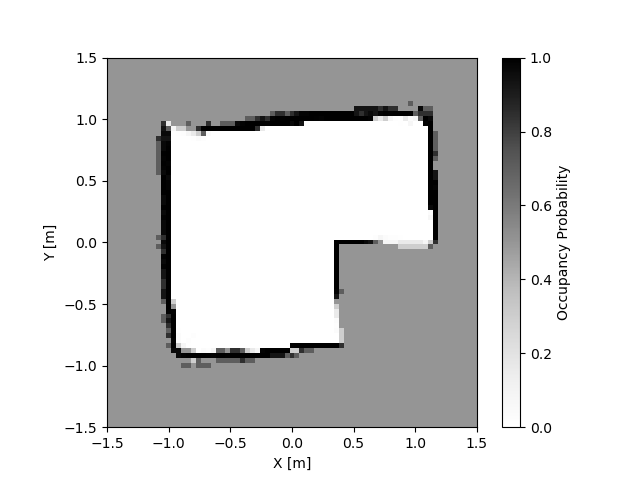
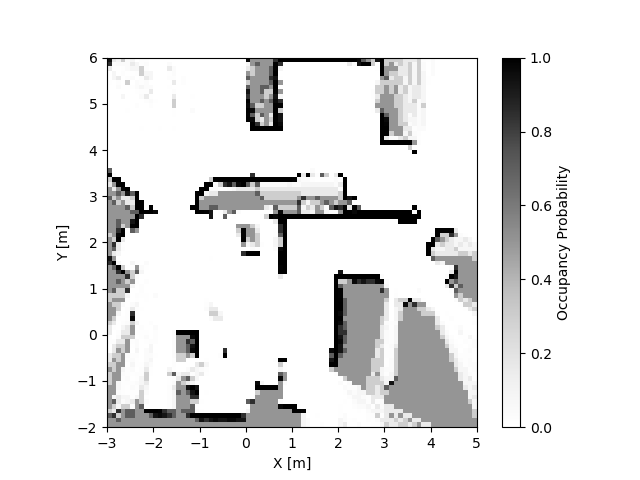
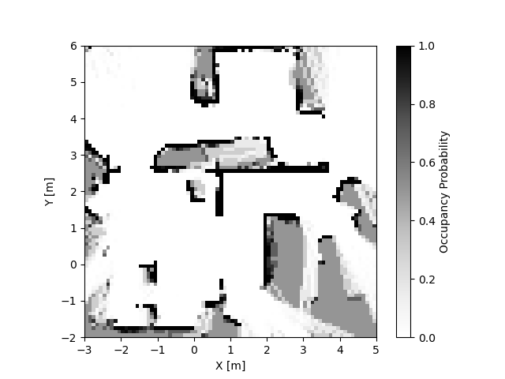
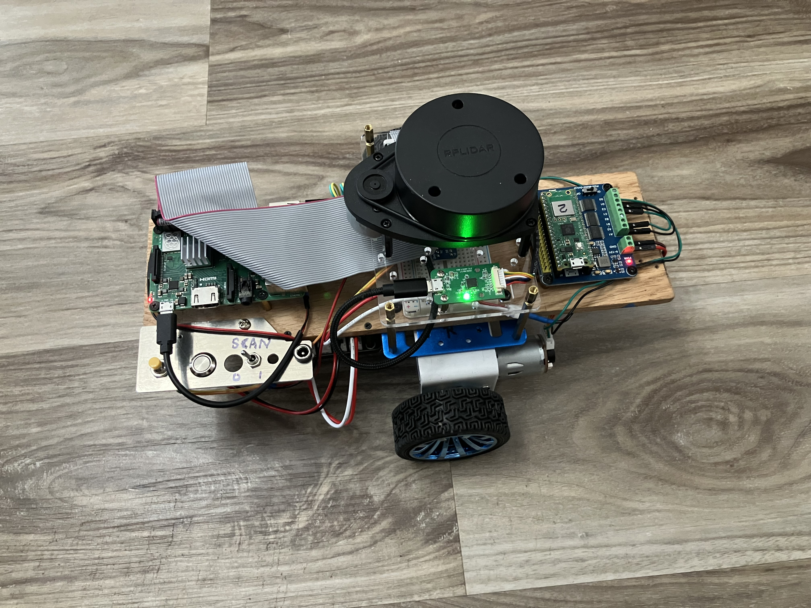

# Notes on building the RaspiBot
* Spoiler Alert! Scroll all the way to the end to see the picture of the completed robot.
> This started out as a *Wish list* to nail down the scope of the proposed project,
but gradually evolved into more of a journal where I keep track of the steps taken along the way.

* Use a Raspberry Pi SBC configured with pyinfra, using the services/MQTT paradigm from LRP3
* *Repurpose* the chassis and RasPi from my old ROS robot
* Will do (roughly) what the picobot aimed to do:
    * Explore and map the house
    * Discover *canyons* wide enough to fit through
    * Find and follow a loop to return home.
* Will have these features:
    * 2 wheel differential drive
    * Slamtec RPLidar A1 distance sensing (connected via Raspi USB)
    * [Sparkfun Optical Tracking Odometry Sensor](https://www.sparkfun.com/products/24904) (connected to Raspi I2C)
        * [YouTube video](https://www.youtube.com/watch?v=WcCNC8wExUc&t=120s) discusses calibration process
    * DC power provided by [Waveshare UPS Module 3S](https://www.amazon.com/waveshare-Uninterruptible-UPS-Module-3S/dp/B0BQC2WNR8/ref=ast_sto_dp_puis) (3x 18650 batts)
        * 3.7 * 3 = 11.1V supplied to [Waveshare motor driver board](https://www.amazon.com/Waveshare-Driver-Raspberry-Driving-Suitable/dp/B09D7MDL2C/ref=ast_sto_dp_puis) (which powers the onboard Pico)
        * 5V power for Raspberry Pi
        * I2C battery monitoring using [INA219.py](https://drive.google.com/file/d/1rSbdvlRwfYJuLa_MSni0Q6e7lDZz0r6w/view)
    * Wheel motors controlled by Raspberry Pi Pico directly.
    * Teleop control via BLE between 2 Picos as described in this [BLE Joystick Controlled Mecanum Car](https://github.com/dblanding/BLE-Joystick-Controlled-Mecanum-Car) project.
        * The driver station is the BLE server.
        * The Pico on board the raspibot is the BLE client (using ony 2 axes).
    * [Raspi Shutdown](https://forums.raspberrypi.com/viewtopic.php?t=334857) via:
        1. Physical button switch
        2. Clickable button on webserver

## Preparing the SD card (as in LRP3 ch3)
1. Prepare a Headless Raspberry Pi for a Robot
    * Raspberry Pi 3B+
    * SD card: 32 GB 
    * Raspberry Pi OS Lite (32-bit)
        * I had a lot of trouble with this using the Raspi-imager on my linux laptop
        * I ended up succeeding by using the imager (v2.03) under windows
        * Also, I noticed that although I selected the 64-bit version, the summary showed me that the 32-bit version was going to be installed.
    * Host Name: raspibot
    * User Name: doug
    * pswd: robot
    * ssh enabled
2. Once the SD card was finished, I inserted it into the Rapberry Pi 3B+
    * `ping raspibot.local`
    * `ssh doug@raspibot.local`
        * Update and upgrade: `sudo apt update -y && sudo apt upgrade -y`
        * `sudo poweroff`
3. Set up SSH Key Authentication
    * During the Raspberry Pi Imager setup, I enabled only password authentication
    * So now I need to enable SSH Key Authentication
        * On my laptop, I already have SSH keys in `~/.ssh/`
        * So I just need to run `ssh-copy-id doug@raspibot.local` to send over the public key.

## Set up pushbutton shutdown on Raspberry Pi
* Pin 5 (GPIO3) is the default for shutdown and wake-up, but I plan to use that pin for I2C.
* To implement a safe shutdown on a Raspberry Pi 3B+ using a GPIO pin other than Pin 5, connect a momentary button between your chosen GPIO pin (e.g., GPIO 26) and Ground (GND), then add `dtoverlay=gpio-shutdown,gpio_pin=26,active_low=1,debounce=200` to /boot/config.txt, changing 26 to your pin's GPIO number to trigger a graceful shutdown when the button is pressed for about 3 seconds. This leverages the built-in gpio-shutdown overlay for simple hardware-based power management. 

#### Hardware Setup 
1. Choose Your Pin: Select any available GPIO pin (e.g. GPIO 26, which is physical pin 37). 
2. Connect the Button: Wire a momentary push button between your chosen GPIO pin and any Ground (GND) pin on the Raspberry Pi header. 

#### Software Configuration 

1. Edit file `config.txt`: Open the configuration file with `sudo nano /boot/firmware/config.txt`. 
2. Add the Overlay: Add the following line to the end of the file, replacing `26` with your chosen GPIO number (e.g., `gpio_pin=21` for GPIO 21): 

`dtoverlay=gpio-shutdown,gpio_pin=26,active_low=1,debounce=200`

* `gpio_pin=26`: Specifies your chosen GPIO. 
* `active_low=1`: Assumes the button connects the pin to ground (pull-up is default). 
* `debounce=200`: Waits 200ms (0.2 seconds) to prevent accidental triggers from button bounce. 

3. Save and Reboot: Save the file (Ctrl+X, then Y, then Enter) and reboot your Raspberry Pi (`sudo reboot`).

Now, pressing the button for about 0.2 seconds will initiate a graceful shutdown.

## Set up program to monitor UPS
* Hook up SDA and SCL pins on UPS to SDA & SCL pins on Raspberry Pi
* `ssh doug@raspibot.local`
* Follow instructions in [Waveshare primer](https://www.youtube.com/watch?v=9xOhMiyDwow)
    * Add file `~/UPS/INA219.py`
    * Enable I2C in raspi-conifg `sudo raspi-config`
    * Run `i2cdetect -y -r 1`
        * Device address is 41
    * Run python file `sudo python3 ~/UPS/INA219.py`
    * Output (typ):
    ```
    Load Voltage:  12.492 V
    Current:        0.081991 A
    Power:          1.024 W
    Percent:       97.0%
    ```

## Install Rplidar s/w
* Follow instructions at RPLidar A1 Python module GitHub repo: [Skoltech Robotics RPLidar](https://github.com/SkoltechRobotics/rplidar)
    * `ssh doug@raspibot.local`
        * `sudo pip3 install rplidar`
            * got the error: externally-managed-environment, This environment is externally managed
            * When I got this error on my laptop, I installed uv, so I will do that here.
        * Install uv with: `curl -LsSf https://astral.sh/uv/install.sh | sh`
        * Install rplidar with: `uv add rplidar-roboticia`
        * Set `~` as the uv project directory: `uv init`
            * This will add a bunch of *uv* related files to *~*.
* Maybe now is a good time to use `pyinfra` to install the following simple example:
``` Python
from rplidar import RPLidar
lidar = RPLidar('/dev/ttyUSB0')

info = lidar.get_info()
print(info)

health = lidar.get_health()
print(health)

for i, scan in enumerate(lidar.iter_scans()):
    print('%d: Got %d measurments' % (i, len(scan)))
    if i > 10:
        break

lidar.stop()
lidar.stop_motor()
lidar.disconnect()
```
        
## Using `pyinfra` to manage the code on the (remote) raspibot
In chapter 4 of Danny Staple's book *Learn Robotics Programming V3 (LRP3)*, he shows how `pyinfra` can be used to keep all the code and configuration up-to-date on remote computers from the laptop. (Just to be clear, since I have elected to install `uv` and set up my `~` directory as a *uv project*, I will continue to manage the *uv* environment directly via ssh, and will use *pyinfra* to maintain the code and the *apt* configuration on the raspibot.)

> To see all the packages that have been added to the *uv environment*, use the command `uv pip list`.
The command `uv pip tree` will show the dependency relationship of packages that were installed incidentally.
 
#### Referring to *LRP3 chapter 4* as a guide:
* **On my laptop**, create a *raspibot* folder. This will contain all the files for the project that are located on the laptop.
* Run the command `uv init` from a terminal inside the *raspibot* folder.
    * This initializes the folder as a *uv-managed Python project*, enabling the use of the `pyinfra` command, which has already been added system-wide as a *uv tool*.
    * It also sets up the folder as a git repository
* Create a file named `inventory.py` in the *raspibot* folder, listing the robot’s details.
* Create a sub-folder named *robot* under *raspibot*. This will contain all the robot's python files.
* Create another folder named *tests* under *robot*.
* Create a file named *rplidar_test.py* under *tests* and copy the above example code into it.
* From a terminal in the *raspibot* folder, run the command: `pyinfra inventory.py files.sync src=robot dest=robot -y`. This will create *robot/tests/rplidar_test.py* on the raspibot.
* Now ssh to the robot `ssh doug@raspibot.local`
    * Run the command `uv run python robot/tests/rplidar_test.py`
    * Produces the following output
```
doug@raspibot:~/robot $ uv run python robot/tests/rplidar_test.py
{'model': 24, 'firmware': (1, 29), 'hardware': 7, 'serialnumber': '92D5EE8BC8E792D6B1E39BF01B034C6C'}
('Good', 0)
0: Got 24 measurments
1: Got 103 measurments
2: Got 103 measurments
3: Got 100 measurments
4: Got 101 measurments
5: Got 100 measurments
6: Got 105 measurments
7: Got 103 measurments
8: Got 103 measurments
9: Got 103 measurments
10: Got 107 measurments
11: Got 105 measurments
```
* Next, edit *rplidar_test.py* code on laptop to save the 10 scans to a pickle file *~/data.pkl*.
* Run `pyinfra inventory.py files.sync src=robot dest=robot -y` again to transfer the changes to raspibot.
* With the robot placed inside the arena, run the rplidar_test script again (from ssh) to generate the file *~/data.pkl* containing the scan data.
* From the laptop, run `scp doug@raspibot.local:data.pkl .` to retrieve the scans.
* On the laptop, run the file *display_lidar.py*, which loads the data and displays it.
    * The image below is *just the last of the 10 scans*.
    * Note the units of angle are *degrees* and the units of distance are *milimeters*.
    * Initially, the scan map was *flipped around the horizontal axis*. To fix it, I had to replace angle with *negative angle*.


## Set up Odometry Sensor
* Run `i2cdetect -y -r 1`
    * Device address is 17
* Test it
    * Add test code to robot/tests folder
        * *otos_test.py*
        * *qwiic_otos.py*
    * sync with `pyinfra inventory.py files.sync src=robot dest=robot -y`
    * ssh to raspibot
        * Add the *sparkfun-qwiic-i2c* library: `uv add sparkfun-qwiic-i2c`
        * run `uv run python robot/tests/otos_test.py`
    * It works!
* To do: Calibrate the OTOS per instructions on [Adafruit video](https://www.youtube.com/watch?v=WSELKAIJeFk&t=4s).

## Additional steps to setting up *pyinfra*
#### Create a file for updating code, which we can keep for later.
* Add a *deploy* directory, and create the file *deploy/update_code.py*
``` python
from pyinfra.operations import files

files.sync(src="robot", dest="robot", delete=True, exclude=("*.pyc", "__pycache__"))
```
* This script will perform the sync, and also ensure certain files are excluded from it. This sends over any changed files in the robot folder, storing them in a robot folder on the Raspberry Pi. With *delete=True*, it will also handle files being renamed or removed.
* Can now use the command `pyinfra inventory.py deploy/update_code.py` to update the code on the raspibot with any changes made to the code in the *robot* folder on the laptop.

#### Updating *apt* packages on the raspibot
* When you’ve installed Raspberry Pi OS on an SD card, the packages and package index can be out of date. It’s common to update them before installing other packages.
* Create the file *deploy/update_packages.py* with the following:
```
from pyinfra.operations import apt

apt.update(
    name="Update apt cache",
    _sudo=True,
)

apt.upgrade(
    name="Upgrade all packages",
    _sudo=True,
)
```
* Can now use the command `pyinfra inventory.py deploy/update_packages.py` keep all the packages on the raspibot up to date.
* Tested it. Took several minutes, but it seemed to work.

#### Update both packages and code
* Create the file *deploy/deploy_all.py*
* By running the `pyinfra inventory.py deploy/deploy_all.py -y`, both the packages and the code on the raspibot will be updated.

#### Updating uv packages on the raspibot
* Because I have chosen to use *uv* to manage the virtual environment on the raspibot, keeping the libraries in that environment up to date would require an additional script.
* I created the file *deploy/update_uv_pkgs.py* on the laptop to do this. (I got this code from Google AI and it isn't guaranteed to work)
* Unfortunately, I couldn't get it to work.
```
doug@HP-Laptop:~/Desktop/raspibot$ pyinfra inventory.py deploy/update_uv_pkgs.py
--> Loading config...
--> Loading inventory...
--> Connecting to hosts...
    [raspibot.local] Connected

--> Preparing operation files...
    Loading: deploy/update_uv_pkgs.py
    [raspibot.local] Ready: deploy/update_uv_pkgs.py

--> Detected changes:
    Operation                                         Change               Conditional Change   
    Upgrade all packages in the project environment   1 (raspibot.local)   -                    

    Detected changes may not include every change pyinfra will execute.
    Hidden side effects of operations may alter behaviour of future operations,
    this will be shown in the results. The remote state will always be updated
    to reflect the state defined by the input operations.

    Detected changes displayed above, skip this step with -y
                             
--> Beginning operation run...
--> Starting operation: Upgrade all packages in the project environment 
    [raspibot.local] sh: 1: uv: not found
    [raspibot.local] Error: executed 0 commands
```
* So I decided I would just continue to manage the uv package environment manually via ssh, as I have been doing.
* Here is a summary of the *uv* environment so far:
    * `ssh doug@raspibot.local`
        * `uv add rplidar-roboticia`
        * `uv add sparkfun-qwiic-i2c`

## Proposed idea for how to do mapping
Several services will run on the RasPi
1. MQTT
    * This will start automatically when the RasPi powers up.
2. Scanner service, publishing scan data via mqtt
    * This will start automatically when the RasPi powers up. At first it will be in **sleep mode** with the scan motor off.
    * It will respond to a trigger (a gpio pin pulled LOW) which will set it into **scan mode**
    * Once started, it will publish scan data on topic "lidar/data"
2. Odometry service, publishing pose data via mqtt
3. Webserver service
    * This will serve up a webpage with a **Start Scanning** button that starts the scanner sending scan data, and a **Stop Mapping** button that returns the scanner to sleep mode.
4. While the robot is being tele-operated, the mapper can run *on the laptop*, subscribing to both the scanner topic and the odometry topic

#### Set up MQTT to run on the Raspibot
> In chapter 6 of LRP3, mqtt was introduced as a way for different programs to send data to each other. Although the topics and messages of the Raspibot will not be the same as those used in the LRP3 book, the installation and setup of MQTT should be the same.

* Create file *deploy/deploy_mqtt.py*
* Edit file *deploy/deploy_all.py*
* Run command `pyinfra inventory.py deploy/deploy_all.py`

#### Test out the idea of starting the scanner in *sleep mode* with the motor off and using a GPIO pin to trigger the motor to start and the sending of scan data.
* Create file *robot/tests/gpio_test.py* to test the use of gpio as trigger.
    * Hook up a switch between pin 11 (gpio 17) and adjacent pin 9 (ground)
    * Test: `ssh doug@raspibot.local` then run `python robot/tests/gpio_test.py`

#### Add the systemD scanner service
Chapter 7 of LRP3 shows how to create services that will start on powerup. Using a similar approach, create a scanner service that starts on powerup, with the scan motor initially turned off. When the service is *awakened* by pulling a GPIO pin *Low*, it publishes scan data  on the topic *lidar/data*.

* Create the file *deploy/service_template.j2*
* Create the file *deploy/deploy_services.py*
* Create the file *robot/scanner.py*
    * Interestingly, whereas *gpio_test.py* was able to *import RPi.GPIO*, *scanner.py* (running under uv) was not.
    * Had to add another uv library: `uv add RPi.GPIO` to get it to run.
    * Also: `uv add paho-mqtt`
* Deploy the *scanner service* by running `pyinfra inventory.py deploy/deploy_services.py -y`
* Listen for data from scanner by first `ssh doug@raspibot.local`
    * Then run command: `mosquitto_sub -t "lidar/#" -u robot -P robot -v`
    * Got a flood of data. Here is just one scan:

> lidar/data [{"a": 356.59, "d": 4070.0}, {"a": 357.97, "d": 4105.25}, {"a": 359.31, "d": 4137.5}, {"a": 0.67, "d": 4170.0}, {"a": 2.02, "d": 4208.75}, {"a": 21.94, "d": 543.5}, {"a": 23.47, "d": 527.5}, {"a": 24.92, "d": 512.5}, {"a": 26.19, "d": 499.5}, {"a": 27.75, "d": 486.75}, {"a": 34.16, "d": 297.75}, {"a": 34.84, "d": 292.0}, {"a": 36.53, "d": 287.0}, {"a": 38.75, "d": 282.0}, {"a": 39.39, "d": 277.25}, {"a": 40.81, "d": 273.0}, {"a": 43.11, "d": 269.25}, {"a": 44.45, "d": 265.5}, {"a": 45.28, "d": 262.25}, {"a": 46.88, "d": 259.5}, {"a": 48.42, "d": 256.5}, {"a": 49.5, "d": 253.75}, {"a": 51.73, "d": 251.25}, {"a": 53.75, "d": 249.0}, {"a": 54.3, "d": 247.0}, {"a": 54.73, "d": 245.0}, {"a": 57.08, "d": 243.0}, {"a": 57.89, "d": 241.25}, {"a": 60.08, "d": 240.0}, {"a": 60.8, "d": 238.75}, {"a": 63.56, "d": 237.75}, {"a": 63.19, "d": 237.0}, {"a": 66.31, "d": 236.25}, {"a": 67.67, "d": 235.5}, {"a": 68.91, "d": 234.75}, {"a": 69.52, "d": 234.25}, {"a": 73.69, "d": 209.0}, {"a": 75.8, "d": 206.0}, {"a": 77.16, "d": 203.5}, {"a": 78.75, "d": 200.75}, {"a": 79.86, "d": 198.75}, {"a": 81.22, "d": 196.75}, {"a": 82.58, "d": 195.0}, {"a": 83.94, "d": 193.25}, {"a": 85.3, "d": 191.25}, {"a": 86.64, "d": 189.5}, {"a": 88.02, "d": 188.25}, {"a": 89.36, "d": 186.75}, {"a": 90.72, "d": 185.5}, {"a": 92.06, "d": 184.25}, {"a": 93.42, "d": 183.5}, {"a": 94.78, "d": 183.0}, {"a": 96.14, "d": 182.25}, {"a": 97.5, "d": 181.25}, {"a": 98.84, "d": 181.0}, {"a": 100.2, "d": 180.5}, {"a": 101.56, "d": 180.0}, {"a": 102.92, "d": 180.25}, {"a": 123.19, "d": 181.0}, {"a": 124.55, "d": 182.0}, {"a": 125.89, "d": 183.0}, {"a": 127.25, "d": 184.25}, {"a": 128.61, "d": 185.25}, {"a": 129.95, "d": 186.25}, {"a": 131.31, "d": 188.0}, {"a": 191.91, "d": 439.0}, {"a": 193.22, "d": 437.0}, {"a": 194.56, "d": 443.25}, {"a": 195.81, "d": 450.0}, {"a": 197.2, "d": 457.0}, {"a": 198.42, "d": 465.0}, {"a": 199.75, "d": 473.0}, {"a": 201.22, "d": 481.25}, {"a": 202.58, "d": 490.5}, {"a": 203.73, "d": 500.75}, {"a": 204.95, "d": 511.25}, {"a": 206.28, "d": 522.0}, {"a": 207.48, "d": 534.0}, {"a": 208.89, "d": 546.5}, {"a": 210.16, "d": 560.75}, {"a": 211.45, "d": 575.5}, {"a": 212.83, "d": 590.75}, {"a": 214.09, "d": 607.5}, {"a": 215.31, "d": 625.5}, {"a": 216.64, "d": 644.25}, {"a": 251.16, "d": 524.25}, {"a": 252.48, "d": 520.0}, {"a": 255.3, "d": 507.0}, {"a": 256.84, "d": 508.75}, {"a": 257.97, "d": 510.25}, {"a": 259.42, "d": 504.0}, {"a": 260.94, "d": 503.5}, {"a": 263.7, "d": 468.0}, {"a": 265.03, "d": 465.0}, {"a": 266.42, "d": 461.75}, {"a": 268.14, "d": 458.75}, {"a": 269.16, "d": 458.25}, {"a": 270.7, "d": 460.25}, {"a": 273.64, "d": 430.75}, {"a": 276.34, "d": 411.75}, {"a": 277.91, "d": 412.75}, {"a": 279.16, "d": 408.5}, {"a": 280.48, "d": 401.75}, {"a": 281.8, "d": 401.75}, {"a": 282.95, "d": 408.75}, {"a": 284.27, "d": 416.0}, {"a": 285.77, "d": 418.0}, {"a": 287.2, "d": 416.75}, {"a": 305.62, "d": 4616.25}, {"a": 306.97, "d": 4709.75}, {"a": 308.33, "d": 4731.75}, {"a": 309.69, "d": 4663.5}, {"a": 313.62, "d": 7769.25}, {"a": 314.97, "d": 7945.75}, {"a": 321.95, "d": 3744.0}, {"a": 323.38, "d": 3698.75}, {"a": 324.73, "d": 3700.25}, {"a": 326.06, "d": 3700.0}, {"a": 327.42, "d": 3751.75}, {"a": 330.12, "d": 4019.25}, {"a": 332.95, "d": 3001.5}, {"a": 334.33, "d": 2932.75}, {"a": 335.69, "d": 2864.0}, {"a": 337.03, "d": 2875.25}, {"a": 338.38, "d": 2960.5}, {"a": 342.31, "d": 3951.25}, {"a": 343.67, "d": 3951.75}, {"a": 345.05, "d": 3952.0}, {"a": 346.41, "d": 3978.5}] 

* Here is a summary of the packages that have been added to the *uv* environment so far:
    * `ssh doug@raspibot.local`
        * `uv add rplidar-roboticia`
        * `uv add sparkfun-qwiic-i2c`
        * `uv add RPi.GPIO`
        * `uv add paho-mqtt`
#### Puzzling Problem: Now lidar data is no longer getting published !!! ???
* I wrote a mapping script to run on my laptop and found that it wsn't able to connect with the MQTT broker on my Raspibot. I fiddled with the configuration a bit, trying to get it to allow connection from the network, but then it got even more broken. The subscriber command above stopped working.
* Next, I did the following:
    1. Ran `pyinfra inventory.py deploy/update_packages.py`
    2. `uv remove paho-mqtt` (It removed all but a pycache file (lacked permission)
    3. Tried to run `pip3 install paho-mqtt`, but it wouldn't let me do it without a venv
    4. So I reinstalled using `uv add paho-mqtt`
* And now it works again.

#### But I still can't connect with the Mqtt broker running on the laptop
* Run command: `mqttui -b mqtt://raspibot.local -u robot --password robot`
    * Connection refused (os error 111): Failed to connect to the MQTT broker mqtt://raspibot.local
* `ssh doug@raspibot.local`
    * Add file */etc/mosquitto/conf.d/custom.conf* with 2 lines:
    ```
    listener 1883
    allow_anonymous true
    ```
    * Restart service with `sudo service mosquitto restart`
* Able to launch mqttui with: `mqttui -b mqtt://raspibot.local -u robot --password robot`
    * But it didn't pick up any "lidar/data" messages.
    * From the ssh terminal, I published `mosquitto_pub -t hello/robot -m "hello" -u robot  -P robot` and this showed up in mqttUI.
    * Next I tried listening on the raspibot w/ `mosquitto_sub -t "lidar/#" -u robot -P robot -v` and now there is nothing there !!! ???
    * Restart the service again `sudo service mosquitto restart`
    * Still nothing on the local subscriber or on the laptop UI.
* Restarted the raspibot and now I get the lidar data on the mqttUI, but only for a while. Tried again a few minutes later and I got nothing.


* Ah Ha!! I think it's a timeout error that occurs because nothing is geting published while the scanner is idle. When the broker doesn't receive any messages within the timeout interval, it just closes the connection.
    * I revised *robot/scanner.py* to publish lidar info every 5 seconds when it is idle.
        * `pyinfra inventory.py deploy/update_code.py`
        * restart service: `sudo service scanner restart`
    * This seems to fix the problem.



#### Write Odometer program to read pose data from Sparkfun Optical Tracking Odometry Sensor and publish it on topic 'odom/pose'
* The program *[robot/odometer.py](robot/odometer.py)* reads pose data (x, y, heading) from the OTOS and publishes it as JSON to the MQTT broker.
* Check distance and angle by driving 1 meter (in X), turning around and returning to start position.
    * OK
* Check with mqttui to make sure the pose data is getting published.
    * OK

#### Write a mapping program that runs on the laptop and builds an OGM
* the map is generated in the Build_OGM class 
* *mapper.py* listens to both "lidar/data" and "odom/pose" topics, saving the most recent values of pose and scan
* Trigger the scanner to start scanning by grounding the gpio pin.
* Place robot approximately in center of arena, facing the chosen *x* direction
* Then start the odometer service with `uv run python robot/odometer.py`
* Now start mapper with the command `uv run python mapper.py`
    * Once per second, mapper calls the update_map method of Build_OGM, using its most recent values of pose and scan as arguments
* mapper makes 10 scans, 1 second apart, as the robot drives slowly under tele-op control
* After the final scan, press *ctrl-c* to save the map and stop the program
* Display the map by running *display_saved_map.py*



* Code revisions w/ goal of improving the quality of the map produced
    * Reduce pose data rounding error
    * Add time stamps to both odom and scan data
    * Add rate of change for pose data



* Adjust pose value to be in sync with mid-scan measurement
    * Using timestamps, estimate pose at time of mid-scan
    * Use this pose for all updates in scan



* Estimate pose value at each individual scan measurement
    * Each map update uses a unique and different calculated pose value



* No apparent improvement over using one estimated pose value for the entire scan
    * This series of tests has used 10 scans at 1 second intervals
    * When updating more frequently, it would be a good idea to compare the cost in terms of execution time for updating the pose value for each individual scan w/r/t the time for using one pose value for the entire scan.

#### Thoughts on *What's next?*
* Look for performance bottlenecks
    * Per specs, the scan motor runs at 5.5 rps.
        * Scans are arriving at the laptop @ approx 7 Hz
        * Being processed by map building @ 1 Hz
    * How about pose data?
        * Received at 10 hz
        * processed by map building @ 1 Hz)
    * Execution time for map update estimating pose for **each measurement** in scan
        * For 10 scans:
            * The average (mean) is: 0.002275 sec.
            * The standard deviation is: 0.000206 sec.
            * The map below was made with 50 scans during a CCW loop through kitchen
            * 
    * Execution time for map update estimating pose **once for entire scan**
        * For 10 scans:
            * The average (mean) is: 0.002018 sec.
            * The standard deviation is: 0.000108 sec.
            * The map below was made with 50 scans during a CCW loop through kitchen
            * 
    * Which is best? I decided to estimate pose **once for entire scan** for these reasons:
        * No discernible difference in map quality
        * Slightly faster execution time for map updates
        * Significantly better repeatability of execution time.
        * For referenced, I kept the version that estimates pose for **each measurement** as *build_ogm_alt.py*
        
* What's next phase of development?
    * I had thought I would have a webserver running on the raspibot for at least 2 purposes:
        1. It was going to have a button for safely shutting down the RasPi
        2. And it was part of my plan for doing mapping.
    * But neither of these reasons is very compelling.
        1. I already have a physical button on the robot for shutting down the RasPi
        2. I don't need a webserver for mapping. The mapping program runs on my laptop.
            * Here is the process I currently use to build a map.
                1. If the bot was just powered up, I restart the scanner service.
                    * I don't know why, but if I don't restart it, scan data doesn't get sent on mqtt.
                2. I ground the gpio pin to start the scanner scanning.
                3. I place the robot precisely at its origin pose.
                4. I start the odometer program (It's not currently set up as a service.)
                5. I start mapper on my laptop.
                    * I tele-operate the robot using the joystick.
                    * Once it has completed the prescribed number of scans, I stop mapper with *ctrl-c*, which saves the map before exiting.
                    * I stop the scanner by disconnecting the gpio pin from ground.
                    * I stop the odometer with *ctrl-c*.
                6. I display the map by running *display_saved_map.py*
            * That's a lot of steps. I may want to consider how I could streamline this into fewer steps.
    * I then looked through all the chapters in LRP3 to see if I am reminded about any uses for a webserver would apply to the raspibot, and found nothing.
    * I also went through all the links on the LRP3 Robot Control Web interface and found nothing there that made me think I need a webserver.
    * So **scratch the webserver**. That's good news for me because now I can cross off *Learn JavaScript* from my *To Do* list.



